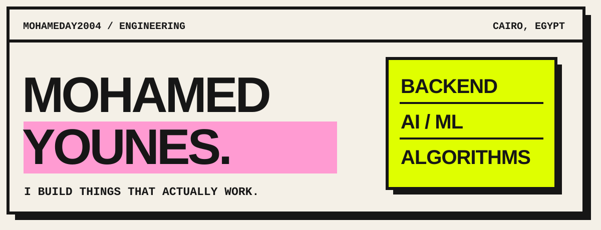

<!-- Profile repository: mohamedAY2004/mohamedAY2004. Keep banner.svg beside this file. -->

  

  
  
  

  

---

## 01 / ABOUT

I like building things that actually work, whether the answer is a deterministic algorithm or a learned model.

I work across **backend engineering, AI/ML, and problem solving**: document retrieval, on-device computer vision, and the APIs that make them useful. I'm building **DocMind** and teaching AI at **Samsung Innovation Campus**.

**ECPC 2026 National Champion / 2x ACPC Finalist**

## 02 / SELECTED WORK

### [DOCMIND](https://github.com/mohamedAY2004/DOCMIND)

An AI document assistant for university education. I built the backend and contributed to the AI layer: document ingestion, retrieval, source-attributed answers, and role-based access. LLM and vector-store providers can be swapped through configuration.

`Python` `FastAPI` `PostgreSQL` `pgvector` `Qdrant` `Docker`

### [MULTIPLEXED TCP CHAT](https://github.com/mohamedAY2004/Multiplexed_TCP_ChatApp)

A chat server that handles multiple connections in one event loop, with message framing, private and broadcast messages, and file transfer.

`Python` `TCP` `Non-blocking sockets` `Selectors`

### [EGYPTIAN CURRENCY DETECTION](https://github.com/mohamedAY2004/Egyptian-Currency-Object-detection)

A YOLO model for recognizing Egyptian banknotes in real time, with a desktop interface for testing camera input. Part of my work on practical, on-device vision.

`YOLO` `Computer vision` `Python`

  
<strong>MORE PROJECTS</strong>

- **[ASL Letter Recognizer](https://github.com/mohamedAY2004/ASL_ML)** — Hand landmarks, classical ML, and a live desktop interface.
- **[Mini RAG](https://github.com/mohamedAY2004/my-mini-rag)** — Retrieval, FastAPI, and application design patterns.
- **[Expression Evaluator](https://github.com/mohamedAY2004/Expression-Evaluator)** — A modified shunting-yard algorithm with custom precedence and associativity.
- **[Nile Academy](https://github.com/mohamedAY2004/Nile-Academy-Servlets-)** — A student-services platform built with Java Servlets.

## 03 / STACK

<strong>LANGUAGES &amp; BACKEND</strong>

  
  
  
  
  
  

<strong>AI &amp; DEVELOPMENT</strong>

  
  
  
  
  
  

- **Languages:** Python, C++, Java, SQL.
- **Backend:** FastAPI, PostgreSQL, SQLAlchemy, pgvector, Qdrant.
- **AI / ML:** TensorFlow, scikit-learn, OpenCV, YOLO, RAG, embeddings.
- **Tools:** Docker, Git, Linux, Postman.

---

**Have something to build? [Let's talk.](mailto:mido.yones1@gmail.com)**
